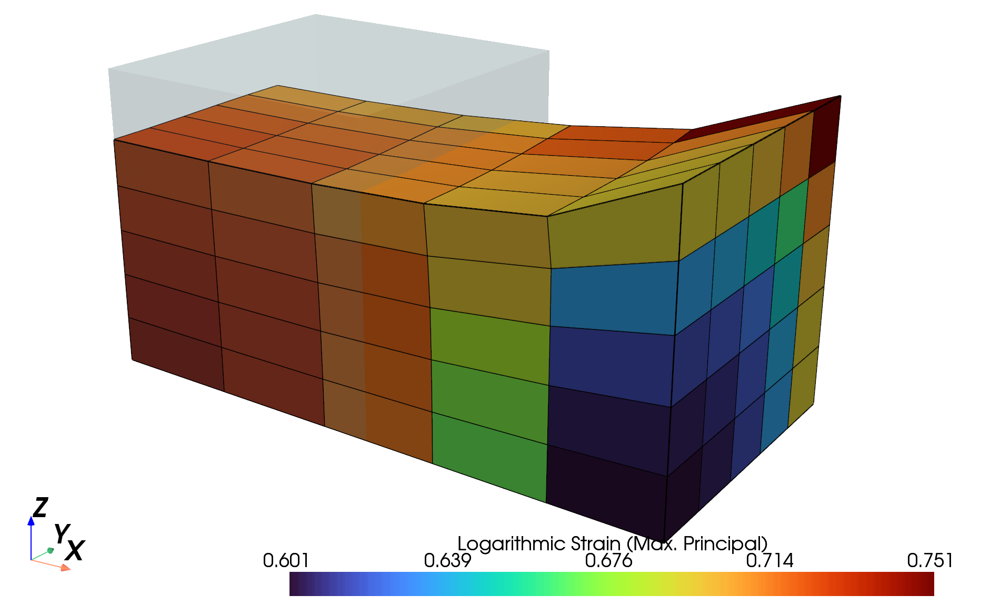

# Summary
FElupe is a Python package for finite element analysis focusing on the formulation and
numerical solution of nonlinear problems in continuum mechanics of solid bodies. This package is intended for scientific research, but is also suitable for running nonlinear simulations in general. In addition to the transformation of general weak forms into sparse vectors and matrices, FElupe provides an efficient high-level abstraction layer for the simulation of the deformation of solid bodies.

## Highlights
- 100% Python package built with NumPy and SciPy
- easy to learn and productive high-level API
- nonlinear deformation of solid bodies
- interactive views on meshes, fields and solid bodies
- typical finite elements
- cartesian, axisymmetric, plane strain and mixed fields
- hyperelastic material models
- strain energy density functions with automatic differentiation

Efficient NumPy-based math is realized by element-wise operating trailing axes [@scikitfem]. The finite element method, as used in FElupe, is based on [@bonetwood], [@bathe] and [@zienkiewicz]. Interactive views are enabled by PyVista [@pyvista]. The capabilities of FElupe may be enhanced with additional Python packages, e.g. `meshio` [@meshio], `matadi` [@matadi], `tensortrax` [@tensortrax], `hyperelastic` [@hyperelastic] or `feplot` [@feplot].

# Features
The essential high-level parts of solving problems with FElupe include a field, a solid body, boundary conditions and a job. A field for a field container is created by a mesh, a numeric region, see \autoref{fig:field}. In a solid body, this field container is combined with a constitutive material formulation. Along with constant and ramped boundary conditions a step is created. During job evaluation, the field values are updated in-place after each completed substep as shown in \autoref{fig:job}.


For example, consider a quarter model of a solid cube with hyperelastic material behavior subjected to a uniaxial elongation applied at a clamped end-face. First, a meshed cube out of hexahedron cells is created. A numeric region, pre-defined for hexahedrons, is created on the mesh. The appropriate finite element and its quadrature scheme are chosen automatically. A vector-valued displacement field is initiated on the region and is further added to a field container. A uniaxial load case is applied on the displacement field to create the boundary conditions. This involves setting up symmetry planes as well as the absolute value of the prescribed displacement at the mesh-points on the right-end face of the cube. The right-end face is clamped, i.e. its displacements, except the components in longitudinal direction, are fixed. An isotropic hyperelastic Neo-Hookean material formulation is applied on the displacement field of a solid body. A step generates the consecutive substep-movements of a selected boundary condition. The step is further added to a list of steps of a job. After the job evaluation is completed, the maximum principal values of logarithmic strain of the last completed substep are plotted, see \autoref{fig:strain}.

```python
import felupe as fem

region = fem.RegionHexahedron(mesh=fem.Cube(n=6))
field = fem.FieldContainer([fem.Field(region, dim=3)])
solid = fem.SolidBody(umat=fem.NeoHookeCompressible(mu=1, lmbda=2), field=field)
boundaries, loadcase = fem.dof.uniaxial(field, clamped=True)

move = fem.math.linsteps([0, 1], num=5)
step = fem.Step([solid], ramp={boundaries["move"]: move}, boundaries=boundaries)
job = fem.Job(steps=[step]).evaluate()

solid.plot("Principal Values of Logarithmic Strain").show()
```

{height="50mm"}

Any other hyperelastic material model formulation may be used instead of the Neo-Hookean material model given above, most easily by its strain energy density function. The strain energy density function of the Mooney-Rivlin material model formulation, as given in \autoref{eq:mooney-rivlin}, is implemented by a hyperelastic material class in FElupe.

\begin{equation}
    \label{eq:mooney-rivlin}
    \psi(\boldsymbol{C}) = C_{10} \left( \hat{I}_1 - 3 \right) + C_{01} \left( \hat{I}_2 - 3 \right)
\end{equation}

```python
import tensortrax.math as tm

def mooney_rivlin(C, C10, C01):
    I1 = tm.trace(C)
    I2 = (I1**2 - tm.trace(C @ C)) / 2
    I3 = tm.linalg.det(C)
    return C10 * (I3**(-1/3) * I1 - 3) + C01 * (I3**(-2/3) * I2 - 3)

umat = fem.Hyperelastic(mooney_rivlin, C10=0.5, C01=0.1)
solid = fem.SolidBody(umat=umat, field=field)
```

# Examples
The documentation of FElupe contains interactive tutorials and examples for simulating the deformation of solid bodies. Resulting deformed solid bodies of selected examples are shown in \autoref{fig:examples}. Computational results of FElupe are used in several scientific publications, e.g. [@dutzler2021], [@torggler2023].


# References
